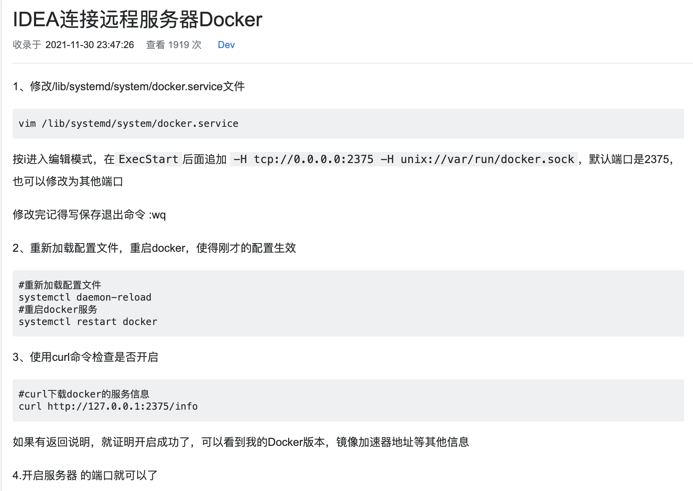
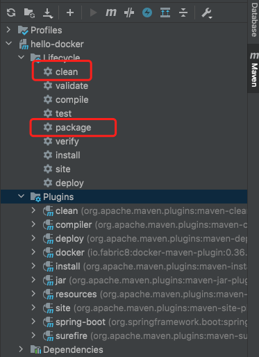
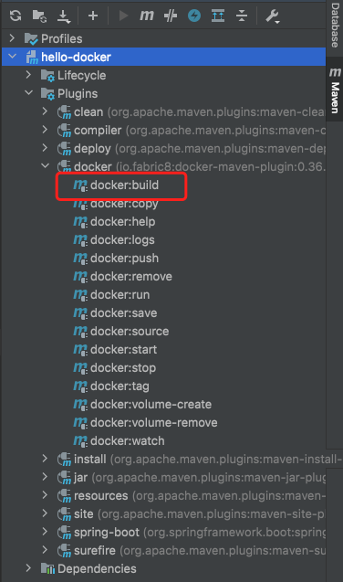
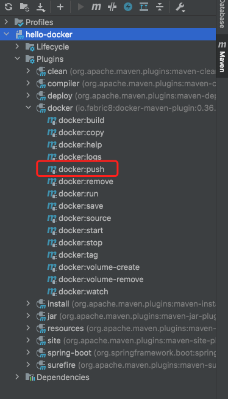
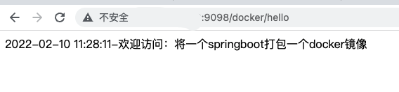

# SpringBoot项目打包为docker镜像

## IDEA打docker镜像并推送

#### 1.docker需要支持远程访问

[网上教程](https://www.1024sou.com/article/570271.html)



#### 2.所在机器的docker能成功登陆仓库

> 如果一步到位需要将打的镜像推送到harbor等仓库，需要docker能够成功登陆仓库
> 
> 1. 所在机器的hosts加入harbor地址
> 
> 2. 修改docker的daemon.json
>    
>    /etc/docker/daemon.jso文件中加入在"insecure-registries"属性加入harbor仓库地址
> 
> 3. 重启docker

#### 3.IDEA集成Docker插件

> [网上教程](https://www.imooc.com/article/290378?block_id=tuijian_wz)

#### 4.使用fabric8 maven插件进行打包，运行，推送远程仓库等

> 使用fabric8 maven插件，进行打包

###### 1.新建一个最简单的springboot项目

```java
@RestController
public class HelloController {
    @RequestMapping("/docker/hello")
    public String hello(){
        SimpleDateFormat df = new SimpleDateFormat("yyyy-MM-dd HH:mm:ss");//设置日期格式
        String now = df.format(new Date());
        System.out.println(now + "-欢迎访问：将一个springboot打包一个docker镜像");
        return now + "-欢迎访问：将一个springboot打包一个docker镜像";
    }
}
```

###### 2.在pom.xml中引入fabric8插件

```xml
<?xml version="1.0" encoding="UTF-8"?>
<project xmlns="http://maven.apache.org/POM/4.0.0" xmlns:xsi="http://www.w3.org/2001/XMLSchema-instance"
         xsi:schemaLocation="http://maven.apache.org/POM/4.0.0 https://maven.apache.org/xsd/maven-4.0.0.xsd">
    <modelVersion>4.0.0</modelVersion>
    <parent>
        <groupId>org.springframework.boot</groupId>
        <artifactId>spring-boot-starter-parent</artifactId>
        <version>2.6.3</version>
        <relativePath/> <!-- lookup parent from repository -->
    </parent>

    <groupId>com.example</groupId>
    <artifactId>hello-docker</artifactId>
    <version>1.0</version>
    <name>hello-docker</name>
    <description>hello-docker</description>

    <properties>
        <java.version>1.8</java.version>
        <plugin.fabric8.version>0.36.0</plugin.fabric8.version>
        <docker.host>tcp://xxxxx:2375</docker.host>
        <docker.registry>xxxxx</docker.registry>
        <docker.username>xxxx</docker.username>
        <docker.password>xxxxx</docker.password>
        <docker.namespace>test</docker.namespace>
        <docker.Dockerfile.name>Dockerfile</docker.Dockerfile.name>
    </properties>

    <dependencies>
        <dependency>
            <groupId>org.springframework.boot</groupId>
            <artifactId>spring-boot-starter</artifactId>
        </dependency>
        <dependency>
            <groupId>org.springframework.boot</groupId>
            <artifactId>spring-boot-starter-web</artifactId>
        </dependency>
    </dependencies>


    <build>
        <plugins>
            <plugin>
                <groupId>org.springframework.boot</groupId>
                <artifactId>spring-boot-maven-plugin</artifactId>
            </plugin>
            <plugin>
                <!--引用fabric8 打包docker镜像插件-->
                <groupId>io.fabric8</groupId>
                <artifactId>docker-maven-plugin</artifactId>
                <version>${plugin.fabric8.version}</version>

                <!--全局配置-->
                <configuration>
                    <!--这一部分是为了实现对远程docker容器的控制-->
                    <!--docker主机地址,用于完成docker各项功能,注意是tcp不是http!-->
                    <dockerHost>${docker.host}</dockerHost>
                    <!--docker远程访问所需证书地址,如果docker远程主机没有启用TLS验证则不需要配证书-->
                    <!--<certPath>${project.basedir}/docker/ssh</certPath>-->

                    <!--这一部分是为了实现docker镜像的构建和推送-->
                    <!--registry地址,用于推送,拉取镜像,我这里用的是阿里的registry-->
                    <registry>${docker.registry}</registry>
                    <!--认证配置,用于私有registry认证,如果忘记了可以去阿里的registry查看-->
                    <authConfig>
                        <push>
                            <username>${docker.username}</username>
                            <password>${docker.password}</password>
                        </push>
                    </authConfig>

                    <!--镜像相关配置,支持多镜像-->
                    <images>
                        <!-- 单个镜像配置 -->
                        <image>
                            <!--镜像名(含版本号)-->
                            <name>${docker.registry}/${docker.namespace}/${project.name}:${project.version}</name>
                            <!--镜像build相关配置-->
                            <build>
                                <!--使用dockerFile文件-->
                                <dockerFile>${project.basedir}/${docker.Dockerfile.name}</dockerFile>
                            </build>
                        </image>
                    </images>
                </configuration>
            </plugin>
        </plugins>
    </build>

</project>
```

fabric8的所有说明都有对应的注释都在<plugin></plugin>中

###### 3.编写对应的Dockerfile

- Dockerfile

```dockerfile
# 指定基础镜像，这是分阶段构建的前期阶段
FROM openjdk:8-alpine as builder
# 执行工作目录
WORKDIR build
# 配置参数
ARG JAR_FILE=target/hello-docker-1.0.jar
# 将编译构建得到的jar文件复制到镜像空间中
COPY ${JAR_FILE} app.jar
# 通过工具spring-boot-jarmode-layertools从application.jar中提取拆分后的构建结果
RUN java -Djarmode=layertools -jar app.jar extract && rm app.jar

# 正式构建镜像
FROM openjdk:8-alpine

WORKDIR application

ENV TZ=Asia/Shanghai JAVA_OPTS="-Xms128m -Xmx256m -Djava.security.egd=file:/dev/./urandom"

# 配置时区
RUN apk add -U tzdata \
    && cp /usr/share/zoneinfo/$TZ /etc/localtime \
    && echo '$TZ' > /etc/timezone

# 前一阶段从jar中提取除了多个文件，这里分别执行COPY命令复制到镜像空间中，每次COPY都是一个layer
COPY --from=builder /build/dependencies/ ./
COPY --from=builder /build/snapshot-dependencies/ ./
COPY --from=builder /build/spring-boot-loader/ ./
COPY --from=builder /build/application/ ./
COPY docker-entrypoint.sh docker-entrypoint.sh

ENTRYPOINT [ "/bin/sh", "docker-entrypoint.sh" ]
CMD ["run-hello-docker"]
```

- docker-entrypoint.sh

```shell
#! /bin/bash
set -e

SERVICE_NAME="hello-docker"

if [ "$1" = "run-${SERVICE_NAME}" ]; then

    # skywalking 开关开启且 agent 目录存在
    if [[ "$SW_AGENT_ROOT" != "" ]] && [[ "$SW_ENABLE" == "true" ]]; then
        AGENT_PATH="$SW_AGENT_ROOT/skywalking-agent.jar"
        # skywalking-agent.jar agent jar 包存在
        if [ -f "$AGENT_PATH" ]; then
            echo "<<<<<<<<<<<<< run ${SERVICE_NAME} with skywalking agent >>>>>>>>>>>>>>>>>>>"
            java $JAVA_OPTS -javaagent:$AGENT_PATH org.springframework.boot.loader.JarLauncher
            exit
        fi
    fi

    echo "<<<<<<<<<<<< run default ${SERVICE_NAME} >>>>>>>>>>>>>>>>>>>>>"
    java $JAVA_OPTS org.springframework.boot.loader.JarLauncher
    exit
fi

echo "<<<<<<<<<<<< run overwrite command: $@ >>>>>>>>>>>>>>>>>>>>>"
exec "$@"
```

###### 4.打docker镜像

- 在IDEA中打出项目的jar



- 打出Docker镜像



- 推送镜像



* 使用命令操作

在项目根目录下执行

```shell
mvn clean package dockerfile:build dockerfile:push
```

#### 5.启动镜像并访问

```shell
docker run -d --name hello -p 9098:9098 xxxxxx/test/hello-docker:1.0
```



## Dokcerfile

[菜鸟教程Dockerfile链接](https://www.runoob.com/docker/docker-dockerfile.html)

> Docker 镜像由众多只读层组成，层即图层，常见于命令行中拉取镜像时的layers。每个图层代表一个 Dockerfile 指令，并不是所有命令会增加图层，只有命令 RUN, COPY, ADD会创建真实的图层。其他指令会创建临时中间镜像，并不会增加构建大小。镜像的这些层是堆叠的，每一层都是前一层增量变化，当我们运行镜像产生容器时，会在镜像顶层追加一层可写层（容器层）。运行时容器做的文件更改，例如写入新文件、修改现有文件和删除文件，都将写入容器层。对镜像层文件操作时，采用写时覆盖的原则，将由上向下查找镜像层文件并复制至容器层进行修改。

#### WORKDIR

指定工作目录。用 WORKDIR 指定的工作目录，会在构建镜像的每一层中都存在。（WORKDIR 指定的工作目录，必须是提前创建好的）。

docker build 构建镜像过程中的，每一个 RUN 命令都是新建的一层。只有通过 WORKDIR 创建的目录才会一直存在。

#### ARG

构建参数，与 ENV 作用一致。不过作用域不一样。ARG 设置的环境变量仅对 Dockerfile 内有效，也就是说只有 docker build 的过程中有效，构建好的镜像内不存在此环境变量。

构建命令 docker build 中可以用 --build-arg <参数名>=<值> 来覆盖。

#### RUN

用于执行后面跟着的命令行命令。有以下俩种格式：

```shell
shell 格式：

RUN <命令行命令> # <命令行命令> 等同于，在终端操作的 shell 命令。
```

```shell
exec 格式：

RUN ["可执行文件", "参数1", "参数2"] # 例如： # RUN ["./test.php", "dev", "offline"] 等价于 RUN ./test.php dev offline
```

#### ENV

设置环境变量，定义了环境变量，那么在后续的指令中，就可以使用这个环境变量。

格式：

```shell
ENV <key> <value>
ENV <key1>=<value1> <key2>=<value2>...
```

#### COPY

复制指令，从上下文目录中复制文件或者目录到容器里指定路径。

```shell
COPY [--chown=<user>:<group>] <源路径1>...  <目标路径>
COPY [--chown=<user>:<group>] ["<源路径1>",...  "<目标路径>"]
```

#### ENTRYPOINT

类似于 CMD 指令，但其不会被 docker run 的命令行参数指定的指令所覆盖，而且这些命令行参数会被当作参数送给 ENTRYPOINT 指令指定的程序。

但是, 如果运行 docker run 时使用了 --entrypoint 选项，将覆盖 ENTRYPOINT 指令指定的程序。

**优点**：在执行 docker run 的时候可以指定 ENTRYPOINT 运行所需的参数。

**注意**：如果 Dockerfile 中如果存在多个 ENTRYPOINT 指令，仅最后一个生效。
